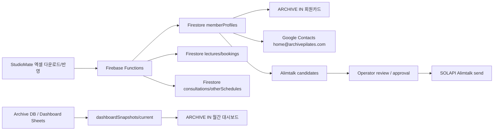

# ARCHIVE IN Mac mini Migration Handoff

마지막 업데이트: 2026-05-22

이 문서는 ARCHIVE IN 프로젝트를 Mac mini에서 이어받아 개발, 배포, 자동화 운영할 때 필요한 기준 문서다.

중요: 이 파일은 GitHub에 올려도 되는 공개 운영 문서다. 서비스계정 JSON, StudioMate 로그인, SOLAPI API Secret 같은 실제 비밀값은 이 문서에 넣지 않는다. 실제 키 값은 로컬 전용 파일 `ARCHIVEIN_MACMINI_PRIVATE_KEYS.md`를 사용한다.

## 1. 프로젝트 기준

- GitHub repo: `https://github.com/archivepilates/archive.git`
- 현재 작업 브랜치: `archivein-canonical-20260514`
- Firebase/GCP project: `archive-pilates`
- Project number: `904688188103`
- Hosting URL: `https://archive-pilates.web.app/archivein/`
- Firebase Functions region: `asia-northeast3`
- Timezone: `Asia/Seoul`
- Node.js: `22`
- 메인 로컬 경로:
  - 현재 Mac: `/Users/kihyokim/Documents/Codex/2026-05-02/in-ai/archive-publish`
  - Mac mini 권장 경로: `$HOME/ArchiveIN/archive`

## 2. Mac mini 초기 설치

```bash
xcode-select --install

brew install git node@22 jq openssl google-cloud-sdk
brew link --overwrite node@22

npm install -g npm@latest firebase-tools
```

Google Cloud SDK가 PATH에 없으면 셸 설정에 추가한다.

```bash
source "$(brew --prefix)/Caskroom/google-cloud-sdk/latest/google-cloud-sdk/path.zsh.inc" 2>/dev/null || true
```

## 3. 저장소 가져오기

```bash
mkdir -p "$HOME/ArchiveIN"
cd "$HOME/ArchiveIN"
git clone https://github.com/archivepilates/archive.git
cd archive
git checkout archivein-canonical-20260514
```

의존성 설치:

```bash
npm install
npm --prefix firebase/kangsain-functions/functions install
```

빌드 확인:

```bash
npm --prefix firebase/kangsain-functions/functions run build
```

## 4. 서비스계정 인증

운영 서비스계정:

```text
archive-codex-operator@archive-pilates.iam.gserviceaccount.com
```

권장 키 위치:

```bash
$HOME/.config/archive-pilates/archive-codex-operator.json
```

Mac mini에서 키 파일을 복구한 뒤:

```bash
chmod 600 "$HOME/.config/archive-pilates/archive-codex-operator.json"

gcloud auth activate-service-account \
  archive-codex-operator@archive-pilates.iam.gserviceaccount.com \
  --key-file="$HOME/.config/archive-pilates/archive-codex-operator.json" \
  --project=archive-pilates

gcloud config set account archive-codex-operator@archive-pilates.iam.gserviceaccount.com
gcloud config set project archive-pilates
```

`~/.zshrc`에 등록:

```bash
export GOOGLE_APPLICATION_CREDENTIALS="$HOME/.config/archive-pilates/archive-codex-operator.json"
export GOOGLE_CLOUD_PROJECT="archive-pilates"
export GCLOUD_PROJECT="archive-pilates"
```

확인:

```bash
gcloud auth list --format='table(account,status)'
gcloud projects describe archive-pilates --format='value(projectId,projectNumber)'
GOOGLE_APPLICATION_CREDENTIALS="$GOOGLE_APPLICATION_CREDENTIALS" npx firebase projects:list --json
```

## 5. 실제 비밀값 위치

실제 비밀값은 아래 둘 중 하나에서 복구한다.

### A. 로컬 전용 Markdown

현재 Mac에서 생성한 로컬 전용 파일:

```text
/Users/kihyokim/Downloads/ARCHIVEIN_MACMINI_PRIVATE_KEYS.md
```

이 파일은 GitHub에 올리지 않는다.

### B. Google Drive 암호화 키

기존 공유 위치:

```text
Google Drive/내 드라이브/10_업무/ArchiveIN/ServiceAccount/archive-codex-operator.json.enc
Google Drive/내 드라이브/10_업무/ArchiveIN/ServiceAccount/SERVICE_ACCOUNT_ENCRYPTED_KEY_README.md
```

복호화:

```bash
mkdir -p "$HOME/.config/archive-pilates"
openssl enc -d -aes-256-cbc -pbkdf2 -iter 200000 \
  -in archive-codex-operator.json.enc \
  -out "$HOME/.config/archive-pilates/archive-codex-operator.json"
chmod 600 "$HOME/.config/archive-pilates/archive-codex-operator.json"
```

## 6. Firebase Secret Manager

ARCHIVE IN Functions는 아래 Secret Manager 값을 사용한다.

```text
STUDIOMATE_LOGIN_ID
STUDIOMATE_LOGIN_PASSWORD
MANAGER_LOGIN_ID
MANAGER_LOGIN_PASSWORD
DASHBOARD_SYNC_KEY
GOOGLE_DWD_SERVICE_ACCOUNT_JSON
SOLAPI_API_KEY
SOLAPI_API_SECRET
SOLAPI_PFID
```

서비스계정 인증 후 Mac mini에서 값을 확인할 수 있다.

```bash
gcloud secrets list --project=archive-pilates
gcloud secrets versions access latest --secret=STUDIOMATE_LOGIN_ID --project=archive-pilates
```

비밀값을 새로 설정할 때:

```bash
printf '%s' 'NEW_SECRET_VALUE' | gcloud secrets versions add SECRET_NAME \
  --data-file=- \
  --project=archive-pilates
```

## 7. 주요 앱/함수 역할

### ARCHIVE IN 웹앱

- 경로: `archivein/`
- 배포 대상: Firebase Hosting `/archivein/`
- Firebase client config: `archivein/firebase-config.js`

### Functions 주요 작업

- `scheduledSyncLecturesDaily`: 매일 00:05 수업/예약 정합성 동기화
- `scheduledPollManagerNotices`: 10분마다 StudioMate 알림 poll
- `scheduledProcessWriteQueue`: 1분마다 출석/결석/메모 StudioMate 쓰기 큐 처리
- `scheduledProcessContactSyncJobs`: 10분마다 Google Contacts 동기화 큐 처리
- `scheduledProcessAlimtalkQueue`: 10분마다 승인된 알림톡 큐 처리
- `scheduledAttendanceReminder`: 매시 출석 체크 리마인더
- `scheduledSyncDashboardDaily`: 매일 00:20 대시보드 스냅샷 동기화
- `adminSyncLecturesRange`: 운영자 수동 동기화
- `processAdminSyncRequest`: 운영자 앱 수동 동기화 요청 처리

## 8. 현재 데이터 흐름



## 9. Google Contacts 기준

- 기준 계정: `home@archivepilates.com`
- `archivepilates@gmail.com`은 과거 이관 원본으로만 본다.
- 동기화 기준은 `memberProfiles`와 `memberContactIndex`다.
- 상담 등록처럼 아직 회원 ID가 없는 연락처는 `consultation_{consultationId}` 키로 임시 동기화한다.
- 중복 전화번호나 위험한 대량 변경은 자동 반영하지 않고 보류한다.

## 10. 알림톡 기준

- Provider: SOLAPI
- 발신 프로필: `SOLAPI_PFID`
- 후보 컬렉션: `alimtalkCandidates`
- 발송 로그: `alimtalkSends`
- 운영 기준:
  - 명확한 안내성 메시지부터 자동화한다.
  - 초기에는 후보 생성 후 운영자 검토/승인을 거친다.
  - 승인된 후보만 `queued` 상태로 전환하고, 서버 워커가 10분마다 발송한다.

관련 문서:

- `docs/solapi-template-data-operating-rules.md`
- `docs/archivein-member-contact-alimtalk-pipeline.md`
- `docs/kakao-alimtalk-automation-handoff.md`

## 11. Mac mini 브라우저 자동화

StudioMate 웹 UI에서 엑셀을 내려받는 자동화는 API 동기화와 별개로 보조 운영 경로다.

관련 문서:

- `firebase/kangsain-functions/MACMINI_STUDIOMATE_EXCEL_AUTOMATION.md`

원칙:

- 공식 StudioMate 웹 UI만 사용한다.
- 캡차, 2FA, 보안 경고, 로그인 만료가 나오면 자동화 중단 후 운영자 확인으로 넘긴다.
- 원본 엑셀은 Google Drive 날짜 폴더에 보관한다.
- GitHub에는 원본 개인정보 파일을 올리지 않는다.

## 12. 배포 명령

Hosting만 배포:

```bash
cd "$HOME/ArchiveIN/archive"
npx firebase deploy --only hosting --project archive-pilates
```

Functions만 배포:

```bash
cd "$HOME/ArchiveIN/archive"
npm --prefix firebase/kangsain-functions/functions run build
npx firebase deploy --only functions --project archive-pilates
```

Firestore rules/indexes:

```bash
cd "$HOME/ArchiveIN/archive"
npx firebase deploy --only firestore:rules,firestore:indexes --project archive-pilates
```

전체 배포:

```bash
cd "$HOME/ArchiveIN/archive"
npm --prefix firebase/kangsain-functions/functions run build
npx firebase deploy --only hosting,functions,firestore:rules,firestore:indexes --project archive-pilates
```

## 13. 운영 확인 명령

최근 주요 로그:

```bash
gcloud logging read \
  'resource.type="cloud_run_revision" AND timestamp>="-2h"' \
  --project=archive-pilates \
  --limit=80 \
  --format='table(timestamp,severity,resource.labels.service_name,textPayload,jsonPayload.message,jsonPayload.phase,jsonPayload.errorMessage)'
```

동기화 함수 로그만:

```bash
gcloud logging read \
  'resource.type="cloud_run_revision" AND (resource.labels.service_name="scheduledpollmanagernotices" OR resource.labels.service_name="scheduledsynclecturesdaily" OR resource.labels.service_name="scheduledprocesscontactsyncjobs" OR resource.labels.service_name="scheduledprocessalimtalkqueue")' \
  --project=archive-pilates \
  --limit=80 \
  --format='table(timestamp,severity,resource.labels.service_name,jsonPayload.message,jsonPayload.seen,jsonPayload.saved,jsonPayload.errorMessage)'
```

Firestore 샘플 확인:

```bash
node - <<'NODE'
const admin = require('firebase-admin');
admin.initializeApp({ projectId: 'archive-pilates' });
const db = admin.firestore();
(async () => {
  const snap = await db.collection('memberProfiles').limit(3).get();
  snap.forEach(doc => console.log(doc.id, doc.data().name, doc.data().phoneLast4));
})();
NODE
```

## 14. 이전 후 체크리스트

- [ ] Git clone 및 브랜치 확인
- [ ] Node 22 확인
- [ ] `npm install` 완료
- [ ] 서비스계정 키 복구
- [ ] `GOOGLE_APPLICATION_CREDENTIALS` 설정
- [ ] `gcloud auth list`에서 서비스계정 active 확인
- [ ] `npx firebase projects:list` 성공
- [ ] Functions build 성공
- [ ] Hosting URL 접속 확인
- [ ] 운영자 로그인 확인
- [ ] 수동 동기화 1회 테스트
- [ ] Google Contacts queue 로그 확인
- [ ] Alimtalk 후보 생성/발송 큐는 실제 발송 전 운영자 확인

## 15. 보안 주의

- `ARCHIVEIN_MACMINI_PRIVATE_KEYS.md`는 GitHub, Notion, 채팅, 공유 폴더에 올리지 않는다.
- 서비스계정 JSON이 노출되면 즉시 키를 폐기하고 새 키를 발급한다.
- SOLAPI API Secret이 노출되면 SOLAPI 콘솔에서 즉시 키를 재발급한다.
- StudioMate 로그인 정보가 노출되면 StudioMate 비밀번호를 즉시 변경한다.
- 배포용 계정과 자동화 계정의 권한은 최소화하고, 필요 없는 OAuth 토큰은 정리한다.
