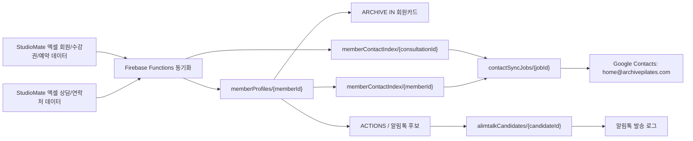

# ARCHIVE IN 회원 프로필, 주소록, 알림톡 파이프라인

마지막 업데이트: 2026-05-22

## 목표

회원 데이터는 StudioMate 엑셀 다운로드/반영 결과를 기준으로 ARCHIVE IN 서버가 한 번 정리하고, 그 결과를 아래 세 곳에서 같이 사용한다.

- 운영자/강사 회원카드
- Google 주소록 동기화
- 카카오 알림톡 대상자 선정

주소록 자동화와 알림톡 자동화가 각각 StudioMate 데이터를 따로 해석하면 동명이인, 연락처 변경, 신규회원 판단, 수강권 만료 판단이 쉽게 어긋난다. 따라서 회원 프로필 정리는 Firebase Functions 쪽에서 공통으로 담당한다.

Google Contacts는 `memberProfiles`를 보강하는 원천이 아니라, StudioMate/Firebase 기준 연락처를 운영자가 쓰기 좋게 복제해두는 보조 저장소다. 즉 기본 흐름은 `StudioMate -> Firebase 회원카드 -> Google Contacts`이고, `Google Contacts -> Firebase 회원카드` 역방향 동기화는 운영 기준이 아니다.

## 데이터 흐름

## Firestore 컬렉션 기준

### `memberProfiles/{memberId}`

회원카드와 자동화가 같이 보는 공통 회원 프로필이다.

필수 필드:

- `memberId`
- `studioId`
- `name`
- `normalizedName`
- `phone`
- `phoneLast4`
- `registeredAt`
- `activeTicketNames`
- `activeTicketCount`
- `sourceUpdatedAt`
- `syncedAt`
- `updatedAt`

운영자 회원카드는 연락처, 활성 수강권, 최근 30일 패턴, 건강이슈/메모, 알림톡 후속 상태를 보여준다. 강사용 회원카드는 건강이슈, 메모, 최근 수업 중심으로 제한한다.

회원 식별 규칙:

- 1순위는 StudioMate `memberId`다.
- `memberId`가 없는 상담/임시 데이터는 정규화된 전화번호로 같은 회원 여부를 판단한다.
- 전화번호도 없을 때만 이름을 보조 키로 사용한다.
- 같은 이름의 회원이 여러 명이면 이름만으로 회원카드, 출결 30일 요약, 알림톡 후보, 수강권 정보를 자동 병합하지 않는다.

### `memberContactIndex/{memberId}`

Google 주소록 동기화 전용 인덱스다. 주소록은 원천 데이터가 아니며, 이 인덱스는 `memberProfiles`에서 파생된다.
상담 등록처럼 아직 StudioMate 회원 ID가 없는 연락처는 `consultation_{consultationId}` 형태의 임시 키로 저장하고, Google Contacts에서는 전화번호 기준으로 같은 사람을 업데이트한다.

필수 필드:

- `memberId`
- `studioId`
- `name`
- `phone`
- `phoneLast4`
- `registeredAt`
- `activeTicketCount`
- `contactTargets.home_archivepilates`
- `syncedAt`
- `updatedAt`

### `contactSyncJobs/{jobId}`

Google People API에 실제 쓰기를 수행할 작업 큐다.

필수 필드:

- `jobId`
- `studioId`
- `memberId`
- `memberName`
- `memberPhone`
- `target`
- `status`
- `attempts`
- `nextRunAt`
- `sourceReason`
- `lastError`

대상 계정:

- `home@archivepilates.com`: ARCHIVE IN/Firebase/Google Contacts 운영 기준 계정

2026-05-15 이후 주소록 동기화 대상은 `home@archivepilates.com`으로 통일한다. `archivepilates@gmail.com` 주소록은 과거 자동화 대상/이관 원본으로만 본다.

기존 Mac mini 연락처 동기화에서 가져올 안전 규칙:

- StudioMate 회원과 Google 연락처는 정규화된 전화번호로 매칭한다.
- 전화번호나 이름이 없는 StudioMate 행은 동기화하지 않는다.
- 동일 전화번호의 Google 연락처가 여러 개 있으면 자동 반영하지 않고 보류한다.
- Google-only 연락처는 삭제하지 않는다.
- Google 연락처 삭제/병합/대량 이동은 자동화 범위에 넣지 않는다.
- 기존 스탭/원장/대표/차단성 라벨이 있는 연락처는 무리하게 덮어쓰지 않는다.
- 신규 생성과 대량 수정은 dry-run 기준 제한을 둔다.

기존 이름 규칙:

- 일반 회원: `StudioMate이름 회원 YYMMDD`
- 강사: `StudioMate이름 강사님`
- 스탭 라벨이 있는 기존 연락처는 표시 이름을 보존한다.

기존 자동 반영 제한:

- 신규 생성 10건 이하
- 기존 수정 50건 이하

이 제한을 초과하면 실제 반영하지 않고 운영자 확인 또는 실패 보고로 넘긴다.

## 동기화 트리거

### 빠른 동기화

StudioMate 알림 poll 또는 회원 관련 API 갱신에서 아래 이벤트를 감지하면 해당 회원만 우선 갱신한다.

- 회원가입/서명완료
- 수강권 등록
- 수강권 환불/사용불가
- 잔여일/잔여횟수 알림
- 상담 등록
- 예약 또는 예약 취소 중 신규회원으로 보이는 케이스

목표 SLA:

- 회원가입/신규등록 알림톡 후보: StudioMate 등록 후 10분 이내
- 회원카드 연락처 갱신: StudioMate 갱신 후 10분 이내
- Google 주소록 반영: 10분 이내 큐 등록, API 오류 시 재시도

### 정합성 동기화

하루 1회 전체 또는 최근 변경분을 다시 훑어 빠진 회원, 연락처 변경, 수강권 상태 변경을 보정한다.

## Google Contacts 인증 기준

Google 주소록 쓰기에는 Google People API 권한이 필요하다.

권장 방식:

1. `home@archivepilates.com`은 Workspace 운영 계정이자 Google Contacts 기준 계정이다.
2. Firebase Functions에서는 서비스계정 도메인 전체 위임으로 `home@archivepilates.com`의 Google Contacts를 수정한다.
3. `archivepilates@gmail.com`은 과거 주소록 이관 원본으로만 사용한다.
4. 서비스계정 JSON 키 파일에 개인 OAuth refresh token을 직접 넣지 않는다.
5. 키와 토큰은 Secret Manager 또는 암호화 파일로 보관하고, GitHub에는 올리지 않는다.

필요 scope:

- `https://www.googleapis.com/auth/contacts`

현재 Firebase 기준:

- `home@archivepilates.com` 연락처 동기화는 서비스계정 도메인 전체 위임을 사용한다.
- 완료보고 메일과 Drive/Sheets 작업도 `home@archivepilates.com` 운영 기준을 따른다.
- Mac mini 자동화가 남아 있으면 `home@archivepilates.com` 기준으로 수정한 뒤 사용한다.

## 알림톡 연결 기준

알림톡 후보도 `memberProfiles`와 같은 회원 식별 기준을 쓴다.

자동 후보 예시:

- 신규회원 등록 후 첫 안내
- 상담 등록 후 방문 전 안내
- 수강권 만료 14일 이내
- 잔여 횟수 5회 미만
- 활성 수강권이 있는데 장기 미방문
- 출석 빈도 급감

명확한 안내성 메시지는 자동 발송 후보로 둘 수 있다. 다만 초반에는 운영자 화면에서 대상자, 사유, 템플릿을 확인하고 발송 또는 제외 처리할 수 있게 한다.

2026-05-15 운영 기준:

- 운영자 화면은 일/주/월 단위의 알림톡 발송 후보를 한 번에 보여준다.
- 자동 발송은 매일 11:30 KST에 실행한다. `scheduledQueueAndSendAlimtalkDaily`가 `memberProfiles.activeTickets`를 직접 스캔해 발송 기준일의 수강권 상태를 재계산하고, 수강권 기간/횟수 안내는 기준일 후보만 `queued` 상태로 넘긴 뒤 큐를 처리한다.
- 예약오픈 안내는 월요일에만 자동 후보를 만들며, 활성 그룹 수강권 보유 회원만 대상으로 한다. 예약주차는 다음 주 월~일로 자동 계산한다. 예: 2026-05-25 기준 `6월1주차(6/1(월)~6/7(일))`. 실제 큐 전환은 예약 시작 오픈 30분 전인 월요일 12:30 KST 전용 스케줄에서만 수행한다.
- 운영자 ACTIONS는 화면 참고용이며, 알림톡 대상자 선정 원천은 현재 회원카드 수강권 상태다.
- 그룹/프라이빗 구분은 구조화 필드를 우선한다. 수업 성격은 `lectures.lessonType`과 `bookings.lessonType`, 수강권 성격은 `memberProfiles.activeTickets[].classType`과 `bookings.ticketClassType`을 기준으로 보고, 수강권명 문자열 추정은 값이 비어 있을 때만 fallback으로 사용한다.
- 운영자 화면과 회원카드에는 알림톡 상태 태그/칩을 표시하지 않는다. 후보 패널, 발송 이력, Google Drive 로그 문서, 메일 보고에서만 확인한다. 알림톡 보고/승인/미제출 알림 메일 제목은 `[알림톡][상태] 핵심내용` 형식을 사용하고, Gmail에는 `알림톡 보고` 라벨과 `자동화 성공`, `자동화 실패`, `자동화 긴급`, `자동화 확인필요` 중 하나를 함께 적용한다.
- 신규회원 웰컴은 기준일 기준 등록 3일 이내 후보만 자동 발송 대상으로 본다.
- 운영자는 필요할 때 후보 명단을 복사해 검토하거나 `일괄 승인`으로 수동 발송 대기 처리할 수 있다.
- 서버 워커 `scheduledProcessAlimtalkQueue`가 5분마다 남은 `queued` 후보를 확인해 SOLAPI로 발송하고, `alimtalkSends/{candidateId}`에 결과를 남긴다.
- 실제 발송은 승인 완료 템플릿만 허용한다. 검수중/보류 템플릿은 후보에는 보일 수 있지만 발송 워커에서 차단한다.

현재 운영 가능 템플릿:

| 목적 | 템플릿 ID | 기준 |
| --- | --- | --- |
| 예약 안내 v3 | `KA01TP260518023011547VpbovK8MrI9` | 월요일 자동 생성. 활성 그룹 수강권 보유 회원 대상, 다음 주 예약주차 자동 계산 |
| 신규회원 웰컴 v3 | `KA01TP260514081318309wQGfeIJxIAJ` | 2026-05-16 이후 최초 등록 3일 이내이며 활성 수업 수강권이 있는 신규회원 |
| 그룹 기간권 잔여기간 안내 v3 | `KA01TP260514145047261araXgWLVFRs` | 활성 그룹 기간권, 만료 14일 이내 |
| 그룹 횟수권 잔여횟수 안내 v3 | `KA01TP260514145047393VpTbcCZKkCV` | 활성 그룹 횟수권, 잔여 5회 미만. 강사레슨/체험권은 제외 |
| 프라이빗 횟수권 잔여횟수 안내 v1 | `KA01TP260514152235608d9icGOBotnV` | 활성 프라이빗 횟수권, 잔여 3회 이하 |
| 프라이빗 기간권 잔여기간 안내 v1 | `KA01TP260514153314927WH270IppWQS` | 활성 프라이빗 기간권, 만료 14일 이내 |
| 프라이빗 사전설문 안내 v1 | `KA01TP260514153632171uiWXYoeiOLS` | 첫 프라이빗 등록/예약 회원 |
| 장기 미방문 수업안내 v1 | `KA01TP260524083643752cySb9BoDOjN` | 활성 수업 수강권 보유, 마지막 출석 7일 이상, 수강권 정지/중지/홀딩 제외. 현재 `PENDING`이라 실제 발송 차단 |

구 수강권 기간/횟수/장기미방문 템플릿 코드는 신규 후보 생성에 연결하지 않는다. `long_absence`는 전용 템플릿과 데이터 연결은 완료했지만 승인 전까지 후보만 생성하고 실제 발송은 차단한다.

운영자가 출산예정 등 개별 예외로 지정한 회원은 모든 알림톡 후보 생성과 발송 직전 검증에서 제외한다.

템플릿별 데이터 연결 기준은 `docs/solapi-template-data-operating-rules.md`를 우선 기준으로 따른다.

SOLAPI 운영 secret:

- `SOLAPI_API_KEY`
- `SOLAPI_API_SECRET`
- `SOLAPI_PFID`

이 값은 Google Secret Manager에 저장하고, Cloud Functions 런타임 서비스계정에 `roles/secretmanager.secretAccessor` 권한을 부여한다. 코드, 문서, GitHub에는 값을 직접 저장하지 않는다.

중복 발송 방지:

- `memberId + ticketId + ruleId + triggerValue` 조합은 1회만 발송한다.
- SOLAPI 요청 전 Firestore transaction으로 발송 lock을 잡는다.
- 발송 직전 `memberId/memberPhone + templateCode + 발송범위` 기반 `dedupeKey`로 성공 발송 이력을 다시 확인한다. 수강권 알림은 수강권명 기준으로 묶고, 남은일수/잔여횟수 변화만으로는 새 발송으로 보지 않는다.
- `dedupeKey` 확인 기간은 템플릿별로 다르게 둔다. 예약 오픈 안내는 6일, 수강권 기간/횟수 안내는 30일, 장기 미방문 안내는 14일, 신규회원 웰컴과 프라이빗 사전설문은 영구 1회로 차단한다.
- 같은 날 한 회원에게 여러 알림이 잡히면 우선순위를 둔다.
- 자동 발송 전 StudioMate 동기화 신선도와 템플릿 `APPROVED` 상태를 확인한다.

## 다음 구현 순서

1. StudioMate 회원 프로필 동기화에서 연락처/등록일/활성 수강권 요약을 채운다.
2. `memberContactIndex`를 생성하고 변경된 회원만 `contactSyncJobs`에 넣는다.
3. People API 인증을 Firebase Secret Manager에 연결한다.
4. `contactSyncJobs` 처리 함수를 만든다.
5. 운영자 회원카드 연락처와 알림톡 후보가 같은 `memberProfiles`를 보도록 정리한다.
6. 신규회원/수강권 만료/잔여횟수 후보를 운영자 ACTIONS와 알림톡 후보로 연결한다.
