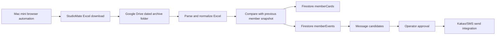

# ARCHIVE IN Mac mini StudioMate Excel Automation

## Goal

Use the ARCHIVE PILATES Mac mini to download StudioMate Excel exports through normal browser automation, upload/archive them through Google Drive, and process them into ARCHIVE IN member data.

2026-05-22 operating note: StudioMate Excel download/import is the default ARCHIVE IN sync mode until ARCHIVE PILATES operates its own site. Do not use the StudioMate API mode for normal operations. The command still uses the legacy `emergency-mode` filename for compatibility: `scripts/run-studiomate-excel-emergency-mode.mjs --download --apply`. It uses a separate command, download folder, logs, and 1-hour LaunchAgent, while reusing the Mac mini StudioMate browser session to avoid duplicate login. It then imports member-list Excel and reservation-history Excel when available. See `docs/studiomate-excel-emergency-mode.md`.

2026-05-21 update: StudioMate `수업 > 삭제된 수업` has the authoritative deleted-class log. The hourly emergency workflow now collects reservation history and deleted-class logs for the ARCHIVE IN reservation-open range, currently today through the next Sunday that is open for reservations. The separate 23:40 deleted-class LaunchAgent is removed to avoid duplicate downloads.

This is not a private API scraper. It should operate like a logged-in manager using the normal StudioMate web UI:

1. Mac mini opens StudioMate in a persistent browser profile.
2. Browser automation navigates to the official export screen.
3. Automation clicks the Excel download button.
4. Downloaded file is moved to a dated Google Drive folder.
5. Importer parses and normalizes member data.
6. Firestore member cards and member events are updated.
7. New member / changed member / message candidate records are created.

Cost and idempotency rule:

- Repeated downloads of the same normalized member, ticket, lecture, or booking data must not rewrite unchanged Firestore documents.
- The hourly runner recalculates `privateSessionLedger` only for members whose private booking source changed.
- Full current-month private chart reconciliation remains a daily 23:30 safety job and must not be invoked by every hourly Excel import.

## Recommended Flow



## Firestore Collections

### `memberCards/{memberId}`

Unified member card used by ARCHIVE IN.

- `memberId`
- `studioMateMemberId`
- `name`
- `phone`
- `registeredAt`
- `activeTickets`
- `lifetimeRevenue`
- `attendance30`
- `recentLessons`
- `healthIssues`
- `memoSummary`
- `updatedAt`
- `sources`

### `memberImportRuns/{runId}`

One document per Excel import.

- `runId`
- `sourceFileName`
- `sourceFileHash`
- `sourceMtime`
- `status`
- `rowsRead`
- `membersUpserted`
- `newMembers`
- `changedMembers`
- `errors`
- `createdAt`
- `completedAt`

### `memberEvents/{eventId}`

Diff events derived from imports.

- `eventId`
- `memberId`
- `eventType`: `new_member`, `profile_changed`, `ticket_changed`, `contact_changed`
- `before`
- `after`
- `sourceRunId`
- `createdAt`

### `messageCandidates/{candidateId}`

Message queue before actual send.

- `candidateId`
- `memberId`
- `eventType`
- `channel`: `kakao`, `sms`, `manual`
- `templateKey`
- `messagePreview`
- `status`: `draft`, `approved`, `sent`, `skipped`, `failed`
- `requiresApproval`
- `createdAt`
- `approvedAt`
- `sentAt`

## Safety Rules

- Use the official StudioMate web UI only.
- Do not bypass captcha, 2FA, IP blocks, or explicit access controls.
- Keep a persistent browser profile on the Mac mini so the manager can re-login manually if needed.
- Stop the job and notify the operator if the login page, captcha, security warning, or changed export UI appears.
- Run at low frequency, such as once per day or when manually triggered.
- Do not auto-send member/customer messages in phase 1.
- Create member/customer message candidates only, and require manager approval.
- Operator completion reports are allowed only for automation run status, sent from `home@archivepilates.com` to `home@archivepilates.com` after verification.
- Operator completion emails should be collected under the Gmail label `자동화 완료보고`.
- Operator completion reports must stay concise and must not include individual member names unless an error or manual review requires it.
- Deduplicate imports using file hash.
- Deduplicate members by StudioMate member ID first, then phone, then exact name only as fallback.
- Keep raw Excel files in Drive as source evidence; do not store raw personal data dumps in Git.
- Store only normalized operational fields in Firestore.

## Mac mini Runtime

Preferred first version:

- Node.js 22 script
- Playwright with a persistent Chromium profile
- LaunchAgent runs on a daily schedule, with an optional manual trigger
- Downloads Excel to a local staging folder
- Moves processed raw files to a dated Google Drive synced folder
- Uses Firebase Admin SDK service account on the Mac mini
- Writes Firestore only after parsing succeeds

Example local paths:

- Browser profile: `~/ArchiveIN/automation/browser-profile`
- Download staging: `~/ArchiveIN/automation/downloads`
- Google Drive archive: `/Users/archivepilates/Library/CloudStorage/GoogleDrive-home@archivepilates.com/내 드라이브/아카이브 정산/회원원본데이터/YYYY-MM-DD`

## Browser Automation Flow

1. Launch persistent Chromium profile.
2. Open StudioMate manager URL.
3. If not logged in, stop and notify operator.
4. Navigate to the member/export screen.
5. Apply required filters, if any.
6. Trigger Excel download.
7. Wait until download is complete and file size is stable.
8. Compute file hash and skip if already imported.
9. Move the raw Excel file to Google Drive archive.
10. Run importer.

## Phase 1 CLI

### Member Excel Download

The first local Mac mini member Excel CLI is:

```bash
npm run studiomate:member-excel
```

Default behavior is safe inspection only:

```bash
DRY_RUN=true npm run studiomate:member-excel
```

Real member Excel download requires an explicit confirmation flag:

```bash
DRY_RUN=false CONFIRM=true npm run studiomate:member-excel
```

Useful environment variables:

- `STUDIOMATE_BASE_URL`: defaults to `https://arcpilates.studiomate.kr`
- `STUDIOMATE_MEMBER_EXPORT_PATH`: defaults to `/users`
- `STUDIOMATE_PROFILE_DIR`: defaults to `~/ArchiveIN/automation/browser-profile`
- `STUDIOMATE_DOWNLOAD_DIR`: defaults to `~/ArchiveIN/automation/downloads`
- `STUDIOMATE_DRIVE_ARCHIVE_DIR`: defaults to `/Users/archivepilates/Library/CloudStorage/GoogleDrive-home@archivepilates.com/내 드라이브/아카이브 정산/회원원본데이터`
- `STUDIOMATE_IMPORT_RUN_LOG`: defaults to `~/ArchiveIN/automation/member-excel-runs.jsonl`
- `STUDIOMATE_MEMBER_EXCEL_INCLUDE_POINT`: defaults to `true`, checks `잔여 포인트`
- `STUDIOMATE_MEMBER_EXCEL_INCLUDE_EXPIRED_TICKETS`: defaults to `true`, checks `만료된 수강권 포함`
- `HEADLESS`: defaults to `false`
- `WAIT_FOR_LOGIN`: defaults to `false`

If the persistent browser profile is not logged in, run:

```bash
HEADLESS=false WAIT_FOR_LOGIN=true DRY_RUN=true npm run studiomate:member-excel
```

Log in manually in the opened browser. The automation resumes after the member page loads and stores the logged-in session in the persistent browser profile.

### Weekly Reservation Availability Deadline

The local Mac mini CLI for StudioMate `설정 -> 운영정보 -> 07. 예약 가능 기한 설정` is:

```bash
npm run studiomate:reservation-deadline
```

Default behavior is safe inspection only:

```bash
DRY_RUN=true npm run studiomate:reservation-deadline
```

Real setting changes require explicit confirmation:

```bash
DRY_RUN=false CONFIRM=true npm run studiomate:reservation-deadline
```

Default target:

- `프라이빗 수업`
- `그룹 수업`
- `예약 가능 일자`: weekly run date, normally that Monday
- `13` days
- `13:00`

Example: on Monday `2026. 5. 11.`, set the reservation availability date to `2026. 5. 11.` and auto-extend `13` days at `13:00`. After `13:00`, StudioMate opens reservations through `2026. 5. 24.`.

Useful environment variables:

- `STUDIOMATE_OPERATION_INFO_PATH`: defaults to `/settings/operations`
- `STUDIOMATE_RESERVATION_AVAILABLE_UNTIL`: optional override such as `2026. 5. 11.`
- `STUDIOMATE_RESERVATION_EXTENSION_DAYS`: defaults to `13`
- `STUDIOMATE_RESERVATION_EXTENSION_TIME`: defaults to `13:00`
- `STUDIOMATE_OUTPUT_DIR`: defaults to `~/ArchiveIN/automation/studiomate-results`
- `WAIT_FOR_LOGIN`: defaults to `false`

First login/setup run:

```bash
HEADLESS=false WAIT_FOR_LOGIN=true DRY_RUN=true npm run studiomate:reservation-deadline
```

Recommended weekly schedule on the Mac mini:

- Every Monday at `12:30`
- Use the Mac mini local timezone, `Asia/Seoul`
- Run in `DRY_RUN=true` until the UI path and field selectors are verified once
- After verification, switch the scheduled command to `DRY_RUN=false CONFIRM=true`

A launchd template is available at:

```bash
firebase/kangsain-functions/macmini-studiomate/com.archive.studiomate-reservation-deadline.plist
```

## Implementation Phases

### Phase 1: Browser Download and Archive

- Create Mac mini automation package.
- Add persistent Playwright profile.
- Download StudioMate member Excel.
- Move raw file to Google Drive dated folder.
- Record `memberImportRuns` with source file hash.

### Phase 2: Import and Compare

- Create importer package.
- Parse `.xlsx` files from the inbox folder.
- Normalize member rows.
- Upsert `memberCards`.
- Create `memberImportRuns`.
- Create `memberEvents` for new/changed members.

### Phase 3: App UI

- ArchiveIN operator app reads `memberCards`.
- Member name click shows role-specific card from unified data.
- Add "new members" and "changed members" action board.

### Phase 4: Message Candidate Queue

- Generate draft messages for `new_member`.
- Operator can approve/skip.
- No automatic external send yet.

### Phase 5: Sending Integration

- Add Kakao Alimtalk/SMS provider only after consent/template policy is confirmed.
- Keep all sends auditable in `messageCandidates`.
