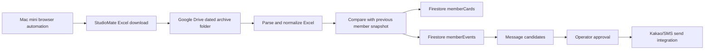

# ARCHIVE IN Mac mini StudioMate Excel Automation

## Goal

Use the ARCHIVE PILATES Mac mini to download StudioMate Excel exports through normal browser automation, upload/archive them through Google Drive, and process them into ARCHIVE IN member data.

2026-05-19 temporary operating note: while StudioMate API access is blocked by the security 403 response, use `scripts/run-studiomate-excel-emergency-mode.mjs --download --apply` as the separate emergency workflow. It uses a separate command, download folder, logs, and 1-hour LaunchAgent, while reusing the Mac mini StudioMate browser session to avoid duplicate login. It then imports member-list Excel and reservation-history Excel when available. See `docs/studiomate-excel-emergency-mode.md`.

2026-05-21 update: StudioMate `수업 > 삭제된 수업` has the authoritative deleted-class log. The hourly emergency workflow now collects reservation history and deleted-class logs for the ARCHIVE IN reservation-open range, currently today through the next Sunday that is open for reservations. The separate 23:40 deleted-class LaunchAgent is removed to avoid duplicate downloads.

This is not a private API scraper. It should operate like a logged-in manager using the normal StudioMate web UI:

1. Mac mini opens StudioMate in a persistent browser profile.
2. Browser automation navigates to the official export screen.
3. Automation clicks the Excel download button.
4. Downloaded file is moved to a dated Google Drive folder.
5. Importer parses and normalizes member data.
6. Firestore member cards and member events are updated.
7. New member / changed member / message candidate records are created.

## Recommended Flow

## Firestore Collections

### `memberCards/{memberId}`

Unified member card used by ARCHIVE IN.

- `memberId`
- `studioMateMemberId`
- `name`
- `phone`
- `registeredAt`
- `activeTickets`
- `lifetimeRevenue`
- `attendance30`
- `recentLessons`
- `healthIssues`
- `memoSummary`
- `updatedAt`
- `sources`

### `memberImportRuns/{runId}`

One document per Excel import.

- `runId`
- `sourceFileName`
- `sourceFileHash`
- `sourceMtime`
- `status`
- `rowsRead`
- `membersUpserted`
- `newMembers`
- `changedMembers`
- `errors`
- `createdAt`
- `completedAt`

### `memberEvents/{eventId}`

Diff events derived from imports.

- `eventId`
- `memberId`
- `eventType`: `new_member`, `profile_changed`, `ticket_changed`, `contact_changed`
- `before`
- `after`
- `sourceRunId`
- `createdAt`

### `messageCandidates/{candidateId}`

Message queue before actual send.

- `candidateId`
- `memberId`
- `eventType`
- `channel`: `kakao`, `sms`, `manual`
- `templateKey`
- `messagePreview`
- `status`: `draft`, `approved`, `sent`, `skipped`, `failed`
- `requiresApproval`
- `createdAt`
- `approvedAt`
- `sentAt`

## Safety Rules

- Use the official StudioMate web UI only.
- Do not bypass captcha, 2FA, IP blocks, or explicit access controls.
- Keep a persistent browser profile on the Mac mini so the manager can re-login manually if needed.
- Stop the job and notify the operator if the login page, captcha, security warning, or changed export UI appears.
- Run at low frequency, such as once per day or when manually triggered.
- Do not auto-send messages in phase 1.
- Create message candidates only, and require manager approval.
- Deduplicate imports using file hash.
- Deduplicate members by StudioMate member ID first, then phone, then exact name only as fallback.
- Keep raw Excel files in Drive as source evidence; do not store raw personal data dumps in Git.
- Store only normalized operational fields in Firestore.

## Mac mini Runtime

Preferred first version:

- Node.js 22 script
- Playwright with a persistent Chromium profile
- LaunchAgent runs on a daily schedule, with an optional manual trigger
- Downloads Excel to a local staging folder
- Moves processed raw files to a dated Google Drive synced folder
- Uses Firebase Admin SDK service account on the Mac mini
- Writes Firestore only after parsing succeeds

Example local paths:

- Browser profile: `~/ArchiveIN/automation/browser-profile`
- Download staging: `~/ArchiveIN/automation/downloads`
- Google Drive archive: `~/Library/CloudStorage/GoogleDrive-*/My Drive/ArchiveIN/StudioMate Excel Archive/YYYY-MM-DD`

## Browser Automation Flow

1. Launch persistent Chromium profile.
2. Open StudioMate manager URL.
3. If not logged in, stop and notify operator.
4. Navigate to the member/export screen.
5. Apply required filters, if any.
6. Trigger Excel download.
7. Wait until download is complete and file size is stable.
8. Compute file hash and skip if already imported.
9. Move the raw Excel file to Google Drive archive.
10. Run importer.

## Implementation Phases

### Phase 1: Browser Download and Archive

- Create Mac mini automation package.
- Add persistent Playwright profile.
- Download StudioMate member Excel.
- Move raw file to Google Drive dated folder.
- Record `memberImportRuns` with source file hash.

### Phase 2: Import and Compare

- Create importer package.
- Parse `.xlsx` files from the inbox folder.
- Normalize member rows.
- Upsert `memberCards`.
- Create `memberImportRuns`.
- Create `memberEvents` for new/changed members.

### Phase 3: App UI

- ARCHIVE IN operator app reads `memberCards`.
- Member name click shows role-specific card from unified data.
- Add "new members" and "changed members" action board.

### Phase 4: Message Candidate Queue

- Generate draft messages for `new_member`.
- Operator can approve/skip.
- No automatic external send yet.

### Phase 5: Sending Integration

- Add Kakao Alimtalk/SMS provider only after consent/template policy is confirmed.
- Keep all sends auditable in `messageCandidates`.
